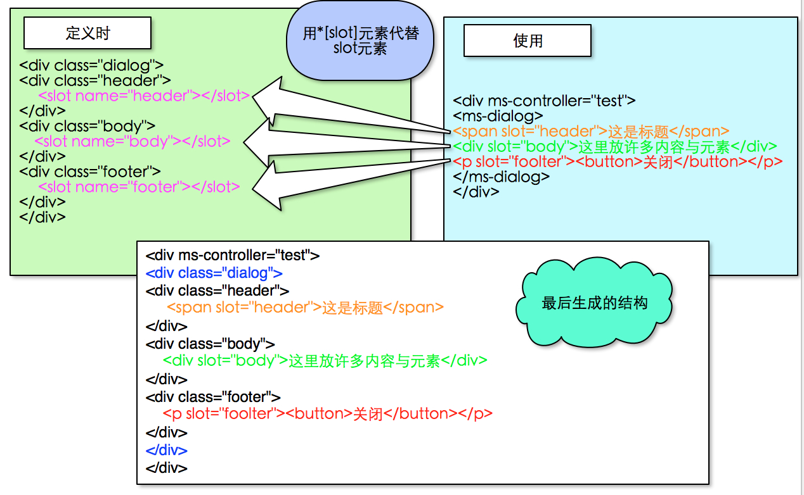

# 组件
avalon拥有两大利器，强大的组件化功能以应对**复杂墙**问题，顶级的虚拟DOM机制来解决**性能墙**问题。

组件可谓是指令的集合，但`1＋1>2`

##组件容器
在avalon2中，有4类标签可以定义组件。分别是wbr, xmp, template, 及ms-开头的自定义标签。其他标签如果使用了ms-widget指令会抛错。

说起自定义标签。之前1.5为了兼容IE6－8，是使用旧式的带命名空间的标签（即中间带冒号的那种标签）作为容器，而Web Component则是使用中间带杠的标签，如`<ms-button>`,风格大相径庭。显然后者是主流，是未来！

经过一番研究，发掘出三大原生标签作为组件定义时的容器。
```
xmp, wbr, template
```

`xmp`是闭合标签，与div一样，需要写开标签与闭标签。但它里面的内容全部作为文本存在，因此在它里面写带杠的自定义标签完全没问题。并且有一个好处时，它是能减少真实DOM的生成（内部就只有一个文本节点）。
```html
<xmp ms-widget="@config">
<ms-button ms-widget="@btn1"><ms-button>
<div>
<ms-tab ms-widget="@tab"><ms-tab>
</div>
</xmp>
```

`wbr`与`xmp`一样，是一个很古老的标签。它是一个空标签，或者说是半闭合标签，像br, area, hr, map, col都是空标签。我们知道，自定义标签都是闭合标签，后面部分根本不没有携带更多有用的信息，因此对我们来说，没多大用处。

```html
<wbr ms-widget="@config" />
```

`template`是HTML5添加的标签，它在IE9－11中不认，但也能正确解析得出来。它与xmp, wbr都有一个共同特点，能节省我们定义组件时页面上的节点规模。xmp只有一个文本节点作为孩子，wbr没有孩子，template也没有孩子，并且用content属性将内容转换为文档碎片藏起来。

```html
<template ms-widget="@config" >
<ms-dialog ms-widget="@config"></ms-dialog>
</template>
```

当然如果你不打算兼容IE6－8，可以直接上ms-button这样标签。自定义标签比起上面三大容器标签，只是让你少写了is配置项而已，但多写了一个无用的闭标签。

```html
<ms-dialog ms-widget="@config" ><ms-panel ms-widget="@config2"></ms-panel></ms-dialog>
<!--比对下面的写法-->
<xmp ms-widget="@config" ><wbr ms-widget="@config2"/></xmp>
<wbr ms-widget='{is:"ms-button"}'/>
<template ms-widget='{is:"ms-button"}'></template>
```

如果你想在页面上使用ms-button组件，只能用于以下四种方式

```html
<!--在自定义标签中，ms-widget不是必须的-->
<ms-button></ms-button>
<!--下面三种方式，ms-widget才是存在，其中的is也是必须的-->
<xmp ms-widget='{is:"ms-button"}'></xmp>
<wbr ms-widget='{is:"ms-button"}'/>
<template ms-widget='{is:"ms-button"}'></template>
```

##配置对象
除了ms-开头的自定义标签不需要指定ms-widget配置对象外,其他三种标签都需要指定ms-widget配置对象，并且这个配置对象里必须有is配置项，其值为要生成的组件名。

avalon2 的默认配置项比avalon1.5 少许多。所有组件通用的配置项

* is, 字符串, 指定组件的类型。如果你使用了自定义标签，这个还可以省去。


* $id, 字符串, 指定组件vm的$id，这是可选项。如果该组件是位于SPA的子页里面，也请务必指定此配置项，能大大提高性能。

* define, 函数, 自己决定如何创建vm，这是可选项。

* onInit, onReady, onViewChange, onDispose四大生命周期钩子。

其他组件需要传入的属性与方法，也可以写配置对象中。为了方便传数据，ms-widget也像ms-class那样能对应一个数组。

```html
<wbr ms-widget="[@allConfig, {$id: 'xxx_'+$index}]"/>
```

> 此外,  如果你的组件是位于SPA的子页面中，或是由ms-html动态生成。但组件对应的真实节点被移出DOM树时，该组件会被销毁。为了进一步提高性能，你可以在组件容器中定义一个cached属性，其值为true，它就能常驻内存。

```html
<wbr cached="true" ms-widget="[@allConfig, {$id: 'xxx_'+$index}]"/>
```

> 用了cached时，必须指定$id配置项。

##插槽元素

为了方便传入很长的HTML格式的参数，web components规范发明了slot插槽元素。avalon使用了一些黑魔法也让旧式IE浏览器支持它。

我们先来看一下不使用插槽元素如何传入大片内容。比如说，我们有这么一个组件：
```javascript
avalon.component('ms-span',{
    template:"<span>{{@content}}</span>",
    defaults: {
       content: ""
    }
})
```

那么外面使用时, 是这样传参的”

```html
<div ms-controller='test'>
<ms-span ms-widget="{content:@aaa}"></ms-span>
</div>
```
页面主VM中添加aaa属性：
```javascript
avalon.define({
   $id: "test",
   aaa: "ms-span的内容,传入进其innerHTML"
})
```
但这样只生成文本,我们要传入复杂的结构,则需要修改组件的模板:
```javascript
avalon.component('ms-span',{
    template:"<span ms-html="@content"></span>",
    defaults: {
       content: ""
    }
})
```
那么我们在VM中将aaa的值变成一个HTML文本就行了.如果这个组件非常复杂, 里面有三处要传入内容的地方:
```javascript
avalon.component('ms-span',{
template:'<div class="com"><div ms-html="@content1"></div>'+
    '<div ms-html="@content2"></div>'+
    '<div ms-html="@content3"></div><div>',
    defaults: {
       content1: "",
       content2: "",
       content3: ""
    }
})
```
那么我们就得在外面的vm中添加三个属性, 在JS中写长长的HTML……显然这是非常不方便编写与维护。从阅读代码的角度来看，这样的属性，其实放在HTML页面上会更好。本来JS就应该与JS呆在一起，而HTML也应该与HTML在一块。插槽元素的出现，为我们解决这难题。


slot元素拥有一个可选的name属性，并且允许多个slot元素拥有同一个name值。

根据DOM4规模这个template元素下所有slot元素会形成一个叫[slots](http://w3c.github.io/webcomponents/spec/shadow/#slots)的东西,而avalon则形成这样一个对象

```javascript
var slots = {
  aaa: [ASlotElement, BSlotElement],//A,B slot元素的name属性值都是aaa
  bbb: [CSlotElement], //C slot元素的name属性值为bbb,
  default: [DSlotElement,ESlotElement] 
  // D,E slot元素没有指定name属性,默认为default
}
```
然后我们在外面使用时, 为自定义标签添加一些子节点, 让它们带有slot属性, 当它们的属性值与 定义时的slot元素的name值一致,就会进行替换操作.从而解决传入大片HTML参数的问题.

如果我们只有一个插入点,并且不想自定义标签内部再写带slot属性的元素, 这时可以使用soloSlot配置项.这时整个innerHTML都默认为soloSlot值的插入点
```html
<!DOCTYPE html>
<html>
    <head>
        <title>TODO supply a title</title>
        <meta charset="UTF-8">
        <meta name="viewport" content="width=device-width, initial-scale=1.0">
        <script src="../dist/avalon.js"></script>
        <script>
      avalon.component('ms-button', {
          template: '<button type="button"><span><slot name="buttonText"></slot></span></button>',
          defaults: {
              buttonText: "button"//指定插入点的默认值
          },
          soleSlot: 'buttonText'//指定插入点的名字
      })
      avalon.define({
          $id:'test',
          aaa: "按钮"
      })
      </script>
</head>
<body>
    <div ms-controller='test'>
        <ms-button>{{@aaa}}</ms-button>
    </div>
</body>
</html>
```
##组件定义

avalon定义组件时是使用avalon.component方法。

avalon.component方法有两个参数,第一个标签名,必须以ms-开头;第二个是配置对象.

配置对象里也有4个配置项

* template,自定义标签的outerHTML,它必须是用一个普通的HTML元素节点包起来,里面可以使用ms-*等指令
* defaults,用来定义这个组件的VM有什么属性与方法
* soleSlot,表示自定义标签的innerHTML为一个默认的插入点 (或可理解为定义标签的innerHTML为当前组件某个属性的属性值) ,可选。
* getTemplate, 用来修改template, 依次传入vm与template, 返回新的模板， 可选。

```
avalon.component('ms-pager', {
      template: '<div><input type="text" ms-duplex-number="@num"/><button type="button" ms-on-click="@onPlus">+++</button></div>',
      defaults: {
          num: 1,
          onPlus: function () {
              this.num++;
          }
      },
      getTemplate: function(vm, template){
         return template.replace('ms-on-click','ms-on-mousenter')
      }
  });  
```

##生命周期

avalon2组件拥有完善的生命周期钩子，方便大家做各种操作。

|  | avalon2| web component | react |
| -- | -- | -- | -- |
| 初始化 | onInit | createdCallback | getDefaultProps |
| 插入DOM树 | onReady | attachedCallback | componentDidMount |
| 视图变化 | onViewChange | attributeChangedCallback | componentDidUpdate |
| 移出DOM树 | onDispose | detachedCallback | componentWillUnmount |


onInit，这是组件的vm创建完毕就立即调用时，这时它对应的元素节点或虚拟DOM都不存在。只有当这个组件里面不存在子组件或子组件的构造器都加载回来，那么它才开始创建其虚拟DOM。否则原位置上被一个注释节点占着。

onReady，当其虚拟DOM构建完毕，它就生成其真实DOM，并用它插入到DOM树，替换掉那个注释节点。相当于其他框架的attachedCallback， inserted, componentDidMount.

onViewChange，当这个组件或其子孙节点的某些属性值或文本内容发生变化，就会触发它。它是比Web Component的attributeChangedCallback更加给力。

onDispose，当这个组件的元素被移出DOM树，就会执行此回调，它会移除相应的事件，数据与vmodel。


##注意事项

在ms-for循环中，请使用务必指定$id。

## 官方组件集


### Promise 
[mmPromise](https://github.com/RubyLouvre/mmDeferred)
```
npm install avalon-promise
```

### ajax组件 
[mmRequest](https://github.com/RubyLouvre/mmRequest)
```
npm install mmPequest
```

### 动画组件 
虽然avalon2已经拥有ms-effect指令,但那是基于CSS3的,在IE6-8下是需要JS库来支持
[mmAnimate](https://github.com/RubyLouvre/mmAnimate)
```
npm install mmAnimate
```

### 弹窗组件 
[ms-modal](https://github.com/RubyLouvre/ms-modal)
```
npm install ms-modal
```

### 分页组件 
[ms-pager](https://github.com/RubyLouvre/ms-pager)
```
npm install ms-pager
```