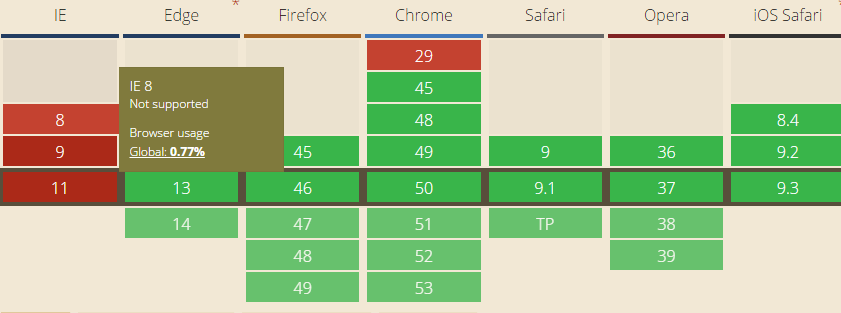

#验证绑定

avalon2新引入的指令，只能用于form元素上，用于为表单添加验证功能。它需要与ms-duplex, ms-rules指令一起配合使用。

>此组件要依赖于Promise，显然Promise支持情况不太好，因此建议大家配合 es6 Promise库一起使用。



ms-validate的值应该对应一个对象，由于对象比较大，建议写在vm，像下面那样:

```javascript
vm.validate = {
   onValidateAll: function(reasons){
     //返回一个数组，如果长度为零说明没有错
   },
 
    onError: avalon.noop,//针对单个表单元素（使用了ms-duplex的input, select）
    onSuccess: avalon.noop,//针对单个表单元素
    onComplete: avalon.noop,//针对单个表单元素
    onReset: avalon.noop,//针对单个表单元素
    validateInBlur: true, // {Boolean} true，在blur事件中进行验证,触发onSuccess, onError, onComplete回调
    validateInKeyup: true, // {Boolean} true，在keyup事件中进行验证,触发onSuccess, onError, onComplete回调
    validateAllInSubmit: true, // {Boolean} true，在submit事件中执行onValidateAll回调
    resetInFocus: true, // {Boolean} true，在focus事件中执行onReset回调,
    deduplicateInValidateAll: false // {Boolean} false，在validateAll回调中对reason数组根据元素节点进行去重
}
```

onError,onSuccess,onComplete, onValidateAll的第一个参数都是reasons对象,this指向被验证的元素,reason里面有你需要的各种东西.
```javascript
var reason = {
    element: elem,
    data: field.data,
    message: elem.getAttribute("data-" + ruleName + "-message") || elem.getAttribute("data-message") || hook.message,
    validateRule: ruleName,
    getMessage: getMessage
}
```

```
<body>
<script>
    var vm = avalon.define({
        $id: "test",
        action: '',
        firstName: '',
        add: function() {
            this.action = "add.php";
            this.validate.onManual();
        },
        update: function(){
            this.action = "update.php";
            this.validate.onManual();
        },
        validate: {
            validateAllInSubmit: false,
            onSuccess: function(reasons, event) {
                console.info('OK')
            },
            onError: function(reasons, event) {
                console.info('error')
            },
            onValidateAll: function(reasons, form) {
                if(reasons.length) {
                    // 表单有错误
                    console.info("error");
                    return false;
                } else {
                    // 验证成功
                    form.submit()
                }
            }

        }
    })
</script>

<div ms-controller="test">
    <form :validate="@validate" id="f1" :attr="{ action: @action }">
        <input type="text" placeholder="Insert your First Name" :duplex="@firstName" :rules="{ required: true }" />
        <input type="submit" value="新建用户 action:  127.0.0.1/add" :click="@add"/>
        <input type="submit" value="修改用户 action: 127.0.0.1/update" :click="@update"/>
    </form>

</div>
</body>

```


有关它的详细用法建议看[ms-rules](ms-rules.md)指令