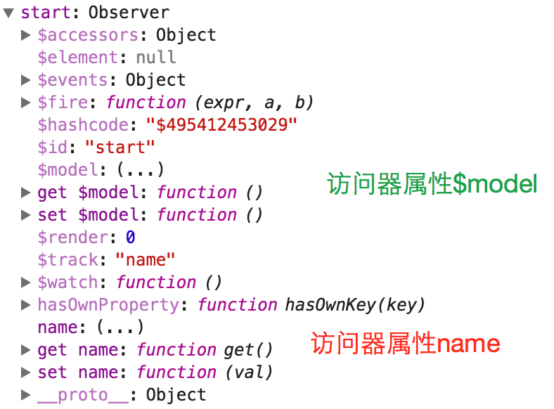

# vm

avalon的所有操作都是围绕vm进行。vm，亦即view model，视图模型。只要我将一个JS对象添加一个$id属性，再放到avalon.define方法里面，就能得到一个vm。

```
 var vm = avalon.define({
    $id: "start",
    name: "test"
})

```

vm是一种利用Proxy或 Object.defineProperties或VBScript创建的特殊对象。

里面以$带头的属性或放到$skipArray，都转换为访问器属性，也就是其他语言的setter, getter。因此如果这个属性最初没有定义，那么它就不会转换为访问器属性，修改该属性，就不会刷新视图。

avalon定义了的vm，都可以在avalon.vmodels中查看到。我们可以在chrome控制台下看一下刚才的start vm的构造。



平时而言，vm是一种比较重型的对象。从占用内存角度来划分，浏览器中的四种对象排行如下：

1. 超轻量 Object.create(null)
2. 轻量 一般的对象 {}
3. 重量 带有访问器属性的对象, avalon VM对象
4. 超重量 各种节点或window对象

##vm的属性与方法

VM中以$开头的属性都是框架保留使用的特殊属性,大家为数据起名字时要小心避开

这些以$开头的属性,目前除了$id, $events, $watch, $fire, $model比较稳定外, 其他系统属性在不同版本存在增删的情况.

1. $id, vm的名字
2. $watch, 用于添加监听函数
3. $fire, 用于触发监听函数
4. $events, 用于储存监听函数
5. $model, 返回一个纯净的JS对象
6. $hashcode, 2.0新增,由于$id无法保证唯一性,使用这个作为UUID
7. $accessors, 用于放置访问器的定义,出现在兼容片的avalon VM上.
10. $render, 2.0新增, 用于生成虚拟DOM树.
11. $element, 2.0新增, 当我们用ms-controller, ms-important指定一个VM的作用域,对应元素节点会放到这个属性上.
12. $track, 1.5新增, 用于实现hasOwnProperty方法. VM的hasOwnProperty会对系统属性返回false


另外，avalon不允许在VM定义之后，再追加新属性与方法，比如下面的方式是错误的：

```javascript
    var vm = avalon.define({
        $id: "test",
        test1: "点击测试按钮没反应 绑定失败"
    })
    vm.one = function () { //不能再追加此方法
        vm.test1 = "绑定成功"
    }
```

但我们可以通过以下方式，实现添加子属性。

```javascript
var vm = avalon.define({
    $id: "test",
    placehoder: {}
});
setTimeout(function () {
    vm.placehoder = {//我们必须要通过 = ，直接添加一个对象来添加子属性， 不能
        aaa: 1, //vm.placehoder.aaa =1; vm.placehoder.bbb = 2这样分散地添加子属性
        bbb: 2
    }
}, 1000)
```

VM中的数据更新，只能通过 = 赋值方式实现。但要注意在IE6-8，由于VM是一个VBScript对象，为VM添加新属性会抛错， 因此我们想批量更新属性要时格外小心了，需要用hasOwnProperty进行过滤。

注意在IE6-8 下，err是VBscript的关键字，VM中存在这个字段，就会将VM中的其他数组变成字符串，详见[这里](https://github.com/RubyLouvre/avalon/issues/627)


##vm是如何作用视图

##vm的运作原理
